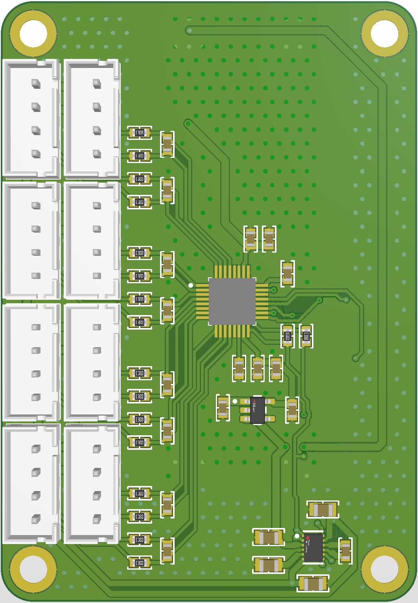
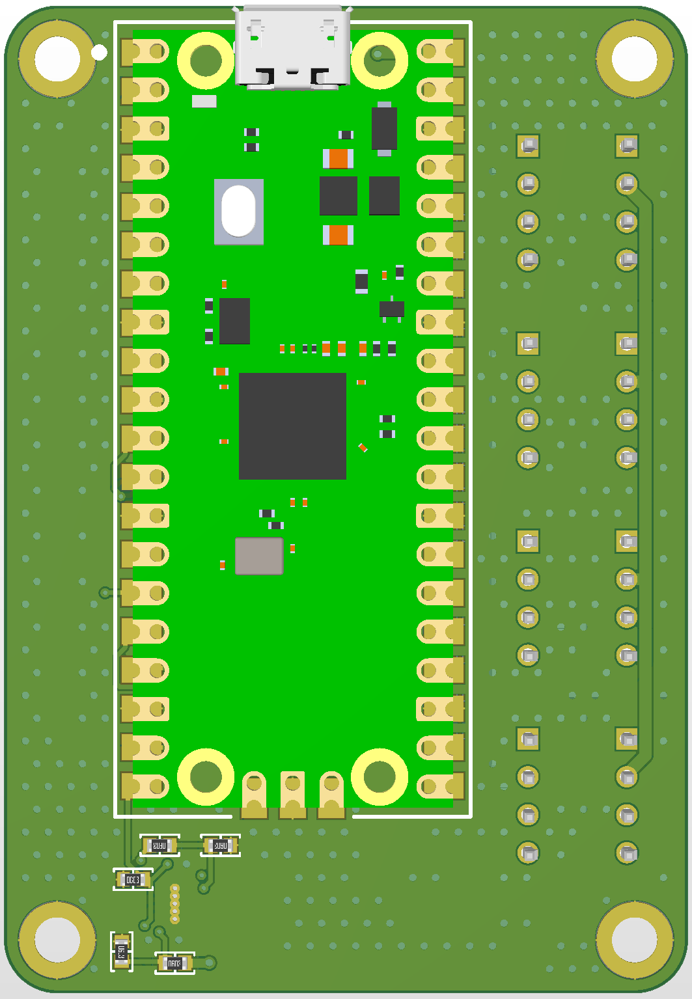

# Raspberry Pi Pico Strain Gauge Data Acquisition System

This project is an 8-channel strain gauge data acquisition system built around the Raspberry Pi Pico. It can also be used for any precision resistance measurement using a Wheatstone bridge. It features a Texas Instruments 8-channel, 24-bit ADC with adjustable gain (1 to 128) and a sampling rate of up to 32 kSPS. The system provides up to 9V, 250mA shared excitation voltage for the channels, which can be adjusted by soldering resistors on the PCB. Future revisions plan to support 10V excitation, which will require a power supply of more than 5.5V.

The PCB for this project was designed using **Altium Designer**.

---
## Background Story

This system was designed for **CLES-FACIL**, the rocket club at **INSA Lyon**, to measure loads on an experimental rocket during flight. The goal is to integrate this data acquisition system into a rocket that has a diameter of only **100mm**, meaning we need to make the system as small and efficient as possible. By using strain gauges, the system will monitor forces on the rocket in real-time, providing critical data that can be used to optimize the rocket's design and performance for future flights.

---

## Features

- **8 Channels**: Supports up to 8 sensors.  
- **High Precision**: 24-bit ADC with adjustable gain (1 to 128).  
- **High Sampling Rate**: Up to 32 kSPS.  
- **Adjustable Excitation Voltage**: Up to 9V (250mA shared), adjustable using resistors soldered on the PCB.  
- **Trusted Components**: This project uses only components from trusted and established manufacturers.  

---

## PCB Design
 
- Currently, the PCB size is **65mm x 45mm**, and the plan is to make it even smaller in future revisions.  
- [View the Schematic Here](hardware/revA/docs/REV_A_SCH.pdf) (PDF).  
- PCB pictures:  
    
    

---

## Future Revisions

- **10V Excitation**: Planned support using a higher voltage non-USB power supply.  
  - **Note**: 10V excitation will require a power supply of more than 5.5V.  
- **RS-485 Networking**: Add support for 10 Mbps communication via RS-485, allowing multiple boards to be connected together. This will require overclocking the Raspberry Pi Pico to 160 MHz.  
- **USB Type-C Connectors**: Replace JST-XH connectors with USB Type-C for their smaller size and affordability (USB 2.0 cables available for as low as $0.30). USB Type-C will also support RS-485 communication.  
- **Power Supply**: Future revisions will likely be powered by 12V or 24V sources, as each board requires up to 10W for the excitation voltage.  
- **Excitation Voltage Control**: For future revisions, I plan to make the excitation voltage adjustable using a DAC for more precise and programmable control.  

---

## TODO List

- [x] Get basic functionality working  
- [ ] Make a CLI-style basic interface  
- [ ] Implement a protocol for RS-485  
- [ ] Measure power supply noise (currently unable due to broken oscilloscope probe)  
- [ ] Make a 2nd revision PCB
- [ ] Delta encoding compression for sending data  

---

## License

Licensed under the MIT License.  

---

## Contact

For questions, contact **Bogdan Seczkowski** or open an issue.
